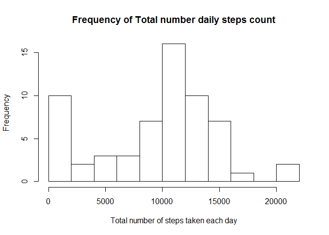
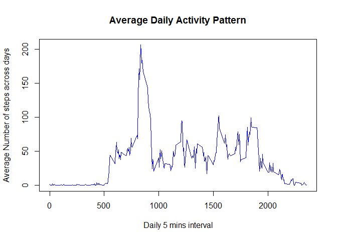
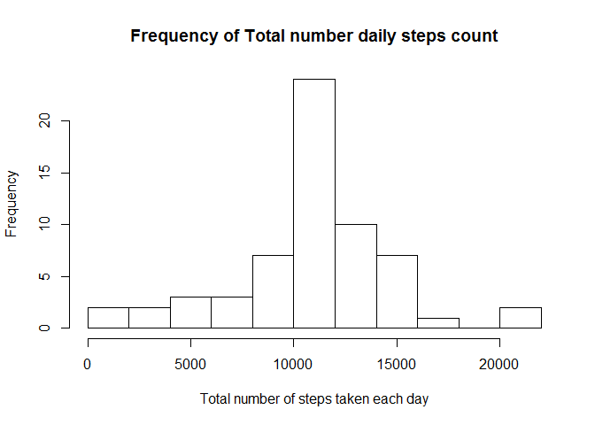

# Reproducible Research: Peer Assessment 1


## Loading and preprocessing the data
Since the data file named "**activity.csv**" is in a zip file named "**activity.zip**", we need to unzip the zip file.

```r
unzip(zipfile='activity.zip', exdir='.', overwrite=T)
```
We now have a new file in the current location with the name "activity.csv".
Now we read the file into a variable called **data**


```r
data <- read.csv("activity.csv", na.strings="NA")
```
We would read some few rows of the data to get an idea of what it contains. And also, use the str() function to get the data type of each column

```r
head(data)
```

```
##   steps       date interval
## 1    NA 2012-10-01        0
## 2    NA 2012-10-01        5
## 3    NA 2012-10-01       10
## 4    NA 2012-10-01       15
## 5    NA 2012-10-01       20
## 6    NA 2012-10-01       25
```

```r
str(data)
```

```
## 'data.frame':	17568 obs. of  3 variables:
##  $ steps   : int  NA NA NA NA NA NA NA NA NA NA ...
##  $ date    : Factor w/ 61 levels "2012-10-01","2012-10-02",..: 1 1 1 1 1 1 1 1 1 1 ...
##  $ interval: int  0 5 10 15 20 25 30 35 40 45 ...
```
We see from the output of the above that the 2 column (**date**) is a Factor variable though its content suggests it should be a date variable. so we will make the change. 

```r
data$date <- as.Date(data$date, "%Y-%m-%d") 
```

## What is mean total number of steps taken per day?
Calculate the total number of steps taken per day.
Make a histogram of the total number of steps taken each day

```r
total_day_steps <- aggregate(data$step, by=list(data$date), FUN=function(v){sum(v, na.rm=T)})
hist(total_day_steps[,2], breaks=15, 
     main="Frequency of Total number daily steps count",
     xlab="Total number of steps taken each day")
```

 

Calculate and report the mean and median of the total number of steps taken per day


```r
mean(total_day_steps[,2], na.rm=T)
```

```
## [1] 9354.23
```

```r
median(total_day_steps[,2], na.rm=T)
```

```
## [1] 10395
```

## What is the average daily activity pattern?


```r
mean_int<-aggregate(data$steps, by=list(data$interval), FUN=function(v){mean(v, na.rm=TRUE)})
names(mean_int) <- c('intervals', 'mean_steps')
with(mean_int, 
     plot(mean_steps~intervals, type='l',
          main="Average Daily Activity Pattern",
          xlab="Daily 5 mins interval", 
          ylab="Average Number of steps across days",
          col='blue')
)
```

 

Which 5-minute interval, on average across all the days in the dataset, contains the maximum number of steps

```r
mean_int[which(mean_int$mean_steps == max(mean_int$mean_steps)),][1]
```

```
##     intervals
## 104       835
```
## Imputing missing values
Calculate and report the total number of missing values in the dataset (i.e. the total number of rows with NAs)


```r
naIdx<- which(is.na(data$steps))
length(naIdx)
```

```
## [1] 2304
```

To fill up the missing values, we are using the mean steps for all similar intervals across days.
Create a new dataset that is equal to the original dataset but with the missing data filled in.

```r
cdata <- data
for (i in seq(length(naIdx))){
    cdata[naIdx[i], 1]= mean_int[which(mean_int[,1] == data[naIdx[i], 3]),][2]
}
```

Make a histogram of the total number of steps taken each day


```r
total_day_steps <- aggregate(cdata$step, by=list(cdata$date), FUN=sum)
hist(total_day_steps[,2], breaks=15, 
     main="Frequency of Total number daily steps count",
     xlab="Total number of steps taken each day")
```

 

Calculate and report the mean and median total number of steps taken per day. Do these values differ from the estimates from the first part of the assignment? What is the impact of imputing missing data on the estimates of the total daily number of steps?


```r
mean(total_day_steps[,2])
```

```
## [1] 10766.19
```

```r
median(total_day_steps[,2])
```

```
## [1] 10766.19
```

## Are there differences in activity patterns between weekdays and weekends?
Create a new factor variable in the dataset with two levels - "weekday" and "weekend" indicating whether a given date is a weekday or weekend day.


```r
library(dplyr)
```

```
## 
## Attaching package: 'dplyr'
## 
## The following object is masked from 'package:stats':
## 
##     filter
## 
## The following objects are masked from 'package:base':
## 
##     intersect, setdiff, setequal, union
```

```r
cdata<- mutate(cdata, weektype=ifelse(weekdays(cdata[,2]) %in% c("Saturday","Sunday"), "Weekend", "Weekday"))
if (class(cdata$weektype) != 'factor') cdata$weektype<-as.factor(cdata$weektype)

mean_step_allday<-aggregate(cdata$steps, by=list(cdata$interval, cdata$weektype), FUN=mean)
names(mean_step_allday)<-c("interval", 'weektype', 'avg')

library(lattice)
xyplot(avg~interval | weektype, layout=c(1,2), data=mean_step_allday, type = 'l', ylab="Number of steps", xlab="Interval")
```

 
